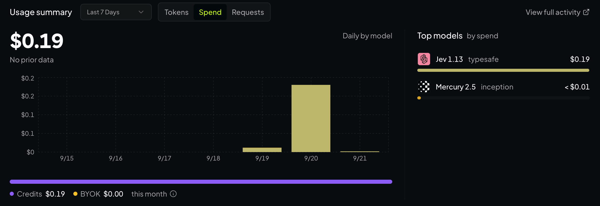

> 🇺🇸 [English](README.md)

# jev-review-mcp

> 一个**单一职责**的代码审查闸门型 MCP 工具，由 **Jev**（TypeSafe 的 System One 决策模型）驱动。一个 MCP，只做一件事。

在 OpenRouter 上的真实成本 —— **7 天内 4.9M tokens · $0.19**：



将 git diff 转化为一个**有类型的决策** —— 无需冗长文本，宿主 agent 也无需了解任何 Jev API。

## 它做什么

`review_patch(diff, context?)` 返回的是一个结构化的判定结果，而非自由文本：

| 字段 | 类型 | 含义 |
|-------|------|---------|
| `verdict` | `approve` \| `request_changes` \| `needs_discussion` | 对本次补丁的总体结论 |
| `safe_prob` | number (0–1) | 无需人工审查即可安全合并的概率 |
| `severity_score` | number (0–4) | 在严重度量表中的索引 |
| `severity_label` | `trivial` \| `minor` \| `moderate` \| `major` \| `critical` | 人类可读的严重度 |
| `confidence` | number (0–1) | 模型对判定结果的校准后把握度 |
| `action` | `auto_merge` \| `human_review` | 宿主接下来应该采取的行动 |
| `recommended` | boolean | 便捷标志 = (`action === "auto_merge"`) |

**决策门（decision gate）：** 仅当 `verdict === "approve"` **且** `safe_prob > 0.8` **且** `confidence >= 0.6` 时，`action` 才为 `auto_merge`。其余所有情况均为 `human_review`。

> ⚠️ 仅在高 `confidence` 时才执行 `auto_merge`。仅凭高的 `safe_prob` 永远不足以作为合并许可 —— 必须以 `confidence` 为门槛。

## 安装与构建

```bash
npm install
npm run build
```

编译后的服务位于 `dist/index.js`。

## 添加至你的 MCP 客户端

```json
{
  "mcpServers": {
    "jev-review": {
      "command": "node",
      "args": ["/absolute/path/jev-review-mcp/dist/index.js"],
      "env": { "TYPESAFE_API_KEY": "ts_xxx" }
    }
  }
}
```

没有密钥？它仍可在 **mock 模式** 下运行（`JEV_MCP_MOCK=1`，或者干脆不设置 `TYPESAFE_API_KEY`），这样你就能离线试用。

## 调用示例

```json
{
  "diff": "diff --git a/src/app.ts b/src/app.ts\n- const x = secret\n+ const x = process.env.SECRET",
  "context": "Move hardcoded secret to an env var"
}
```

返回类似如下结果：

```json
{
  "verdict": "request_changes",
  "safe_prob": 0.2,
  "severity_score": 4,
  "severity_label": "critical",
  "confidence": 0.7,
  "action": "human_review",
  "recommended": false
}
```

## 模型端点

兼容任何 Jev 兼容的端点。默认是 TypeSafe API
（`https://api.typesafe.ai/v1/systemone`）；可通过 `JEV_BASE_URL`
（例如一条 OpenRouter 兼容的路由）覆盖，并将 `TYPESAFE_API_KEY` 设为你的
服务商密钥。

## 环境变量

| 变量 | 默认值 | 说明 |
|----------|---------|-------------|
| `TYPESAFE_API_KEY` | — | TypeSafe 的 Jev 密钥。缺失 ⇒ mock 模式 |
| `JEV_MCP_MOCK` | `0` | 设为 `1` 可强制启用确定性的离线 mock |
| `JEV_MODEL` | `jev-latest` | 发送给端点的模型 id |
| `JEV_BASE_URL` | `https://api.typesafe.ai/v1/systemone` | API 基础 URL |
| `JEV_MCP_TIMEOUT_MS` | `30000` | 每次调用的超时时间（毫秒） |

## Mock 模式

在没有密钥（或 `JEV_MCP_MOCK=1`）时，服务会基于**关键词启发式**给出
**确定性**的回答 —— 适用于演示、测试和离线开发。单一推导出的风险信号
驱动每一个字段，因此 mock 始终保持内部一致
（有风险的 diff → 低 `safe_prob`、高严重度、`human_review`）。

## 诊断

```bash
node dist/index.js doctor          # 人类可读
node dist/index.js doctor --json   # 机器可读
```

打印 mock/live 模式、密钥是否存在、模型以及基础 URL。

## 测试

```bash
npm test
```

在确定性 mock 模式下，针对编译输出运行一次冒烟测试（smoke test）。

## 补充说明

- Jev 是一个**决策**模型：纯文本进 → 有类型的决策出。它不读取图像，也不生成
  冗长文本。
- 为了控制在 Jev 约 64k token 的预算内，diff 会在 60k 字符处被截断。
- 始终让人保持在回路中：任何不是高置信度 `auto_merge` 的请求都应转交给人工
  处理。

## 许可证

MIT
